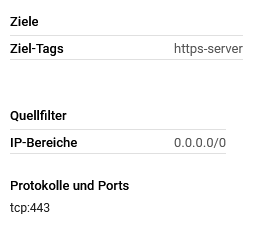

# Sicherung des Webtraffics mit HTTPS

## Inhaltsverzeichnis

- [Sicherung des Webtraffics mit HTTPS](#sicherung-des-webtraffics-mit-https)
  - [Inhaltsverzeichnis](#inhaltsverzeichnis)
  - [1 Ziele](#1-ziele)
  - [2 Planung](#2-planung)
  - [3 Vorbereitung](#3-vorbereitung)
  - [4 Installation HTTPS für Reverse Proxy](#4-installation-https-für-reverse-proxy)
    - [4.1 Let's Encrypt und Certbot](#41-lets-encrypt-und-certbot)
    - [4.2 Certbot installation & Austellung des Zertifikates](#42-certbot-installation--austellung-des-zertifikates)
    - [4.3 Wie funktioniert Certbot/Let's Encrypt?](#43-wie-funktioniert-certbotlets-encrypt)
  - [5 Umleitung von HTTP auf HTTPS](#5-umleitung-von-http-auf-https)
  - [6 Upstream Traffic sichern mit HTTPS](#6-upstream-traffic-sichern-mit-https)

## 1 Ziele

- Zertifikat für Webserver wurde erstellt 
- Installierter Webserver ist über HTTPS erreichbar
- Umleitung von HTTP-Aufruf auf HTTPS wurde definiert

## 2 Planung

- Der Reverse Proxy muss einen Server haben, der auf Port 443 hört und mit TLS arbeitet
- Der Reverse Proxy braucht ein von einer Root-Ca unterschriebenes Zertifikat
- Der Reverse Proxy braucht einen zweiten Server, der auf Port 80 hört und Anfragen auf den HTTPS Server umleitet
- Der Reverse Proxy muss die Ports 80 und 443 geöffnet haben
- Auf der Google Cloud Firewall muss der Reverse Proxy auf Port 80 und 443 erreichbar sein 

## 3 Vorbereitung 

Damit Traffic über den HTTPS Standardport 443 empfangen werden kann, muss dieser offen sein. Dies muss ich sowohl auf der Google Cloud Firewall, sowie auf dem Reverse Proxy selbst machen. 

Firewallregel für Port 443 auf dem Reverse Proxy hinzufügen:

    firewall-cmd --permanent --zone=public --add-port=443/tcp
  
Die allow-https Regel:

## 4 Installation HTTPS für Reverse Proxy

Der Traffic wird über den Nginx Reverse Proxy laufen. Hier ist also der erste Punkt, welche mit HTTPS gesichert werden muss.

### 4.1 Let's Encrypt und Certbot

Let's Encrypt ist eine Non-Profit Organisation, welche kostenlose TLS-Zertifikate bereitstellt.

Certbot ist ein Tool der EFF (Electronic Frontier Foundation), welches ein automatische Bereitstellung von Zertifikaten mit Let's Encrypt ermöglicht.

### 4.2 Certbot installation & Austellung des Zertifikates

Certbot kann sehr einfach installiert werden. Es gibt ein Plugin, welches certbot direkt mit Nginx arbeiten lässt. Das Zertifikat wird erstellt und anschliessend in der nginx.conf erfasst. Danach ist der Nginx Reverse Proxy direkt mit HTTPS gesichert.

    sudo yum install certbot python3-certbot-nginx

    sudo certbot --nginx -d zuericloud.ch

    Successfully deployed certificate for zuericloud.ch to /etc/nginx/nginx.conf
    Congratulations! You have successfully enabled HTTPS on https://zuericloud.ch

### 4.3 Wie funktioniert Certbot/Let's Encrypt?

Für die Austellung des Zertifikats muss Let's Encrypt sicherstellen, dass diese Domain, für welche man ein Zertifikat haben möchte, einem selbst gehört. Dafür arbeitet Let's Encrypt mit "Challenges".

Mögliche Challenges können sein:

- Ein A-Record unter der Domain, welche auf den Server zeigt, von welchem der CSR (Certificate Signing Request) kommt
- Eine Ressource, die über den HTTP-Server erreichbar ist. Ähnlich wie die Google-site-Verification als "Meta" Tag im HTML Head der Seite.

## 5 Umleitung von HTTP auf HTTPS

Die Umleitung von HTTP auf HTTPS kann man über den Nginx Reverse Proxy machen. Hierfür fügt man einen neuen server {} Block in die nginx.conf ein. Dieser Server hört auf Port 80 und leitet alle Anfragen mit einem HTTP 301 an den HTTPS Server weiter. $request_uri ist eine Umgebungsvariable von Nginx, welche die genaue URI der Anfrage speichert.

        server {
                listen 80;
                return 301 https://zuericloud.ch$request_uri;
        }

## 6 Upstream Traffic sichern mit HTTPS

TLS nutzt eine Ende-zu-Ende Public/Private Key Verschlüsselung, welche mit jedem Sitzungsaufbau neu ausgehandelt wird. Diese Verschlüsselung wird jedoch auf dem Reverse Proxy terminiert.

Für viele Applikationen ist es sinnvoll, den Traffic hinter dem Reverse Proxy ebenfalls mit HTTPS zu sichern, auch wenn Server hinter dem Reverse Proxy oftmals in einem vom WAN getrennten LAN sitzen.

Um den Traffic zu sichern, braucht man entweder ein eigene CA oder ein Zertifikat, welches durch eine öffentliche Root-CA gezeichnet wurde.

**Quellen:**

https://docs.nginx.com/nginx/admin-guide/security-controls/securing-http-traffic-upstream/

https://letsencrypt.org/how-it-works/
