# Anforderungen

## Inhaltsverzeichnis
- [Anforderungen](#anforderungen)
  - [Inhaltsverzeichnis](#inhaltsverzeichnis)
  - [1 Idee](#1-idee)
  - [2 Übersicht Webserver](#2-übersicht-webserver)
  - [2.1 Wireguard Server](#21-wireguard-server)
  - [3 Nginx Reverse Proxy](#3-nginx-reverse-proxy)
    - [3.1 RHEL Übersicht](#31-rhel-übersicht)
    - [3.2 Installation Nginx Reverse Proxy](#32-installation-nginx-reverse-proxy)
  - [4 Installation Nginx Webserver für die Züri Cloud Startseite](#4-installation-nginx-webserver-für-die-züri-cloud-startseite)
    - [4.1 Wichtige Befehle im Umgang mit Docker](#41-wichtige-befehle-im-umgang-mit-docker)
    - [4.2 Dockerfile für den Startseiten-Container](#42-dockerfile-für-den-startseiten-container)
    - [4.3 Dockerfile für den Node.js-Container](#43-dockerfile-für-den-nodejs-container)
    - [4.4 Docker Ignore](#44-docker-ignore)
  - [5 Container Deployment auf Google Cloud für Node.js- und Frontend-Container](#5-container-deployment-auf-google-cloud-für-nodejs--und-frontend-container)
    - [5.1 Bereitstellen der Images](#51-bereitstellen-der-images)
    - [5.2 Container erstellen](#52-container-erstellen)
    - [5.3 Python Script konfigurieren](#53-python-script-konfigurieren)
  - [7 Testing](#7-testing)
  - [7.1 Problem mit /status Seite](#71-problem-mit-status-seite)

## 1 Idee

Für das Modul wollte ich mit Containern und Google Cloud arbeiten. Dabei möchte ich eigene Docker Images erstellen, um diese anschliessend deployen zu können.

Auf der Website der Züri Cloud AG soll später der Status aller Dienste zu sehen sein. Dafür habe ich mit Node.js eine API programmiert, welches Daten empfangen und im Frontend darstellen kann. Die Daten werden durch Python Scripts auf den einzelnen Servern an die API gesendet. Die Daten aus der API werden ebenfalls auf zuericloud.ch/status dargestellt. Abrufbar ist die API über die URL zuericloud.ch/api.

## 2 Übersicht Webserver

Die Server werden alle auf der Google Cloud Platform installiert.

| Rolle             | Server  | Platform       | Pfad                         |
|-------------------|---------|----------------|------------------------------|
| Reverse Proxy     | Nginx   | Compute Engine | zuricloud.ddns.net           |
| Firmenseite & CMS | Nginx   | Compute Engine | zuricloud.ddns.net/          |
| Nextcloud         | Apache  | Compute Engine | zuricloud.ddns.net/nextcloud |
| Status Seite      | Nginx   | Container OS   | zuricloud.ddns.net/status    |
| API               | Node.js | Container OS   | zuricloud.ddns.net/api       |

## 2.1 Wireguard Server

Um eine sichere Kommunikation in die Google Cloud zu ermöglichen, habe ich einen Wireguard Server installiert. Dies war auch eine gute Aufgabe, um den Umgang mit RHEL zu lernen. Dokumentation: <https://gitlab.com/eliagarzi/test/-/tree/main/Wireguard>

Ebenfalls hat nur der IAM Gateway und der Wireguard Server Zugriff auf die SSH Schnittstellen der einzelnen Server.

## 3 Nginx Reverse Proxy

Die Idee ist es, einen Reverseproxy auf Basis von NGINX zu installieren. Dadurch kann ich zentral die Zertifikate der dahinterliegenden Server verwalten und benötige auf der Google Cloud auch nur eine statische Public IP. Diese Public-IP verknüpfe ich mit der Domain zuericloud.ch.

### 3.1 RHEL Übersicht

Da ich mehr Erfahrung mit Red Hat Enterprise Linux sammeln möchte, nutze ich es für diese Modul für den Nginx Reverse Proxy und den Nextcloud Server.

**Paketmanager yum und dnf:**

yum update

yum upgrade

yum install

yum remove

**Servicemanager Systemd:**

systemctl restart service

systemctl enable service

systemctl start service

**Firewall verwalten:**

firewall-cmd

--permanent

--add-port=51820/udp

--zone=public

Der Standardeditor in RHEL8 ist Vi. Bisher habe ich hauptsächlich mit nano gearbeitet.

**Wichtige Vi Befehle:**

i Insert Modus

: command Modus

:wq write and quit

:q quit (! zum forcen)

### 3.2 Installation Nginx Reverse Proxy

Konfiguration des Nginx Reverse Proxy: <https://gitlab.com/eliagarzi/test/-/blob/main/Konfiguration/Reverse%20Proxy/nginx.conf>

Für den Nginx Reverse Proxy erstelle ich eine neue Compute Engine Instanz.

Ohne /mainline = Stable Image

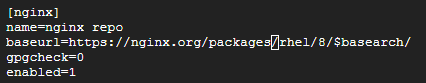

Die Paketlisten updaten und Nginx aus dem zuvor definierten Repository installieren.

      sudo yum update

      sudo yum install nginx

Mit systmctl enable wird der Service Nginx bei einem Neustart des Servers automatisch gestartet.

      sudo systemctl enable nginx

      suod systemctl start nginx

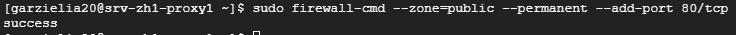

Mit CURL überprüfen, ob der Webserver erreichbar ist

      curl 127.0.0.1

Falls man als Response HTTP 200 OK erhält, ist alles soweit in Ordnung.

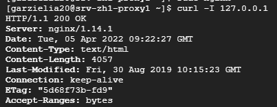

Nun muss man den Server so konfigurieren, dass er wie ein Proxy-Server arbeitet. Die Konfiguration für RHEL8 Nginx findet man unter /etc/nginx/nginx.conf. Den bestehenden HTTP-Server kann man nun so bearbeiten, dass er nicht mehr auf das Root-Directory des eigenen Server zeigt, sondern als Proxy arbeitet.

Die gesamte nginx.conf ist unter <https://gitlab.com/eliagarzi/test/-/blob/main/Konfiguration/Reverse%20Proxy/nginx.conf> zu finden

        location /nextcloud {
                proxy_pass         http://10.172.0.4:80;
                proxy_http_version 1.1;
                proxy_set_header   Upgrade $http_upgrade;
                proxy_set_header   Connection keep-alive;
                proxy_set_header   Host $host;
                proxy_cache_bypass $http_upgrade;
                proxy_set_header   X-Forwarded-For $proxy_add_x_forwarded_for;
                proxy_set_header   X-Forwarded-Proto $scheme;
        }

|Parameter           |Beschreibung                                                                                                  |
|--------------------|--------------------------------------------------------------------------------------------------------------|
| proxy pass         | Gibt die Ziel-Adresse amn (Webserver hinter dem Proxy)                                                       |
| proxy_http_version | Für das Weiterleiten wird HTTP 1.1 genutzt                                                                   |
| proxy_set_header   | Upgrade wird genutzt, wenn der Request von 1.1 auf 2.0 oder von HTTP auf HTTPS gewechselt werden soll        |
| proxy_set_header   | Connection keep-alive gibt an, dass die Verbindung zwischen Client und Server bestehen bleiben soll          |
| proxy_set_header   | Host gibt den Host an, der im Header mitgegeben wird (Nginx Proxy)                                           |
| proxy_cache_bypass | Wenn Upgrade im Header gesetzt wird, wird der Nginx Cache umgangen                                           |
| X-Forward-For      | Standard Header, damit der HTTP Server hinter dem Proxy die original IP kennt                                |
| X-Forward-Proto    | Standard Header, damit der HTTP Server hinter dem Proxy das original Protokoll kennt (HTTP/HTTPs/ Websocket) |

Quellen: <https://developer.mozilla.org/en-US/docs/Web/HTTP/Headers>

Um zu überprüfen, ob die Konfiguration richtig ist und keine Fehler enthält, kann man diese mit dem Befehl **nginx -t** prüfen.

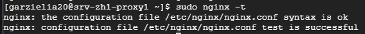

Anschliessend muss der httpd_can_network_connect SELinux Parameter auf 1 gesetzt werden, nur so kann Nginx den Traffic forwarden. Damit alle Änderungen angewendet werden, muss der Nginx Server neugestartet werden.

    setsebool -P httpd_can_network_connect 1

    systemctl restart nginx

Wenn man nun auf die Url http://zuericloud.ch/ verbindet, erhält man nicht mehr die Standard-Seite des Nginx-Server, sondern die Standardseite vom Nextcloud Server, welcher Apache nutzt. Später wird man so Nextcloud erreichen können.

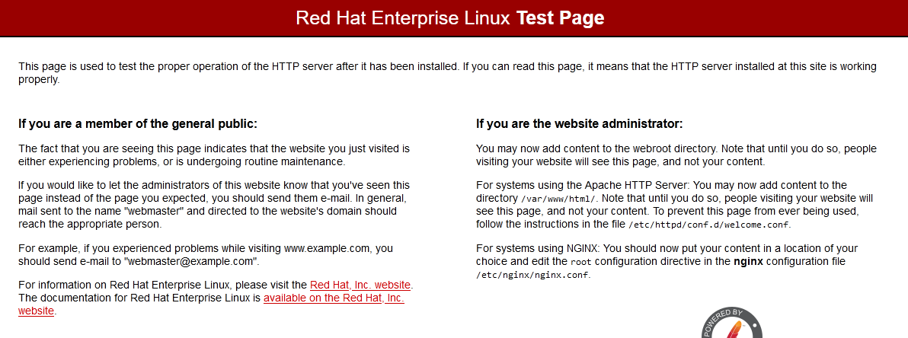

Quellen:

Installation nginx auf rhel8: <https://docs.nginx.com/nginx/admin-guide/installing-nginx/installing-nginx-open-source/>

Typische nginx.conf Fehler: <https://www.nginx.com/resources/wiki/start/topics/tutorials/config_pitfalls/>

Nginx als Webserver: <https://docs.nginx.com/nginx/admin-guide/web-server/web-server/>

Nginx als Proxy-Server: <https://docs.nginx.com/nginx/admin-guide/web-server/reverse-proxy/>

## 4 Installation Nginx Webserver für die Züri Cloud Startseite

**Die gesamten Konfigurationsfiles für das Projekt sind unter Konfiguration abgelegt: <https://gitlab.com/eliagarzi/test/-/tree/main/Konfiguration>**

Die Firmenwebseite soll per Nginx Container betrieben werden. Dazu habe ich ein eigenen Docker Image erstellt. Die Website habe ich ebenfalls selber erstellt.

### 4.1 Wichtige Befehle im Umgang mit Docker

| Befehl          | Aufgabe                                         | Optionen                                                                                                   |
|-----------------|-------------------------------------------------|------------------------------------------------------------------------------------------------------------|
| docker run      | Container aus Image erstellen                   | -d (Detach = Hintergrundprozess) -p (Port angeben z.B. 80:80) -rm (Container nach beenden sofortr löschen) |
| docker pull     | Dockerimage aus einem Repository herunterladen  | Image-URL                                                                                                  |
| docker push     | Dockerimage in ein Repository pushen            | Repository-URL                                                                                             |
| docker ps       | Auflisten aller Container                       |                                                                                                            |
| docker images   | Auflisten aller Images                          |                                                                                                            |
| docker image rm | Löschen eines bestimmten Images                 | Image-ID angeben                                                                                           |
| docker build    | Erstellen von Dockerimages aus einem Dockerfile | -t Name und Tag angeben . aktuelles Verzeichnis                                                            |

**Dockerfile**

| Befehl           | Aufgabe                                                                                |
|------------------|----------------------------------------------------------------------------------------|
| FROM             | Gibt das Baseimage an                                                                  |
| RUN              | Befehle die im Bauprozess ausserhalb des Containers ausgeführt werden sollen           |
| COPY             | Datein die in den Container kopiert werden sollen                                      |
| WORKDIR          | Gibtr das aktuelle Working Directory an -> mit ./ kann man darauf referenzieren        |
| CMD              | Befehle im Container ausführen, wenn dieser startet. Bspw. CMD ["python3", "script.py"]|

### 4.2 Dockerfile für den Startseiten-Container

Source-Files (inkl. Dockerfiles): <https://gitlab.com/eliagarzi/test/-/tree/main/Konfiguration/Zuricloud%20Website>
nginx.conf: <https://gitlab.com/eliagarzi/test/-/blob/main/Konfiguration/Zuricloud%20Website/nginx.conf>

Im folgenden der Aufbau des Docker Images:

      FROM nginx

      RUN rm /etc/nginx/nginx.conf /etc/nginx/conf.d/default.conf

      COPY api /usr/share/nginx/html/api

      COPY start /usr/share/nginx/html/

      COPY nginx.conf /etc/nginx/nginx.conf

1. FROM: Als Baseimage wird Nginx genommen. Dies gibt uns einen funktionierenden Nginx Server.
2. RUN: Die Standardkonfiguration vom Nginx Server wird gelöscht
3. COPY: Kopiert den api Ordner in das Verzeichnis /usr/share/nginx/html/api
4. COPY: Kopiert den start Ordner in das Verzeichnis /usr/share/nginx/html/start
5. COPY: Kopiert meine nginx.conf in das /etc/nginx/ Verzeichnis

Anschliessend muss man im selben Verzeichnis wie das Dockerfile sein. Mit dem Befehl

    docker build -t zuericloudwebsitecontainer

kann man ein Docker Image aus dem Dockerfile "bauen". Wenn man Docker zusammen mit WSL (Windows Subsystem for Linux) installiert hat, funktioniert dies auch unter Windows.

Mit dem folgenden Befehl kann der Container direkt aus Visual Studio Code gebaut und anschliessend gestartet werden. Sobald der Container gestoppt wird, wird dieser automatisch gelöscht. So kann man testen, ob der Container wirklich funktioniert.

    docker run --rm -it $(docker build -q .)

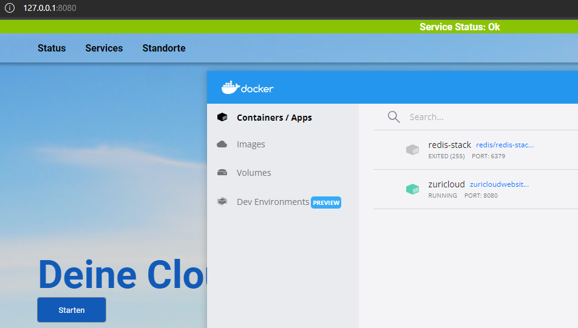

Anschliessend deploye ich die Images auf meine eigene Google Cloud Artifacts Registry und kann diese danach auf dem Containerhost installieren.

### 4.3 Dockerfile für den Node.js-Container

**Repository für die API: <https://github.com/eliagarzi/zuericloudmonitoring>**

Die Service-Status Website habe ich auf Basis von Node.js und Express.js programmiert. Das Frontend wird vom Nginx Server ausgeliefert. Die Clients stellen anschliessend requests an die Node.js API, die auf einem zweiten Container läuft.

    FROM node:16

    WORKDIR /server/

    COPY package*.json ./

    RUN npm install

    COPY . .

    ENV PORT=8080

    EXPOSE 8080

    CMD [ "npm", "start"]

1. FROM: Als Baseimage wird Node.js 16 genutzt, hier ist bereits alles installiert (Node.js und NPM)
2. WORKDIR: ./ repräsentiert das aktuelle Verzeichnis
3. COPY: package.json und package-lock.json definieren unsere App (Umfasst Abhängigkeiten und startscripts)
4. RUN: Installiert alle Abhänigkeiten aus package.json im Container (Express, Node-Cache und Cors)
5. COPY: Kopiert alle Dateien in das Workdir
6. ENV PORT: Der Port der als Umgebungsvariable gespeichert wird
7. EXPOSE: Der Container wird, wenn nicht anders angegeben, auf Port 8080 exposed
8. CMD: Führt das Script "start" ("node server.js") aus package.lock beim Start des Containers aus

### 4.4 Docker Ignore

Mit einem .dockerignore File kann man Datein aus dem Build-Prozess von Docker ausschliessen.

**API Image: <https://github.com/eliagarzi/zuericloudmonitoring/blob/main/api/Dockerfile>**

Die node_modules sind die Abhängigkeiten, die man mit NPM installiert. Diese werden beim Build-Prozess automatisch installiert.

    node_modules
    .gitignore

**Frontend Image: <https://gitlab.com/eliagarzi/test/-/blob/main/Konfiguration/Zuricloud%20Website/Dockerfile>**

Dies sind die SCSS Files. SCSS ist ein Precompiler für CSS. Die Dateien sind nur für die Entwicklung notwendig.

    start/styles.scss
    api/styles.scss

## 5 Container Deployment auf Google Cloud für Node.js- und Frontend-Container

### 5.1 Bereitstellen der Images

Quelle: <https://cloud.google.com/artifact-registry/docs/docker/store-docker-container-images#gcloud>

**Voraussetzungen:**

- Installierte Google Cloud SDK
- Google Cloud SDK initalisiert
- Docker ist installiert

Zuerst muss man eine neue Container Registry erstellen. Diese speichert die Container-Images. Um eine neue Container Registry in der Zone "Europe-West6" (Zürich) zu erstellen, führt man folgenden Befehl aus

      gcloud artifacts repositories create docker-repo --repository-format=docker --location=europe-west6 --description="Docker repository"

Damit sich Docker an der Artifact Registry authentifizieren kann, muss man folgenden Befehl ausführen. (Wieder für die Region eu-west6)

      gcloud auth configure-docker europe-west6-docker.pkg.dev

Die Images "zueriapi" und "zuerifrontend" habe ich bereits gebaut. Nun muss man diese für den Upload in die Registry taggen.

      docker tag zuerifrontend europe-west6-docker.pkg.dev/symmetric-hull-345606/docker-repo/zuerifrontend
      docker tag zueriapi europe-west6-docker.pkg.dev/symmetric-hull-345606/docker-repo/zueriapi

Um die Images nun hochzuladen, nutzt man Docker push.

      docker push europe-west6-docker.pkg.dev/symmetric-hull-345606/docker-repo/zueriapi
      docker push europe-west6-docker.pkg.dev/symmetric-hull-345606/docker-repo/zuerifrontend

### 5.2 Container erstellen

Hierzu erstellt man eine neue Compute Engine Instanz mit dem "Container Optimized Os". Dies ist ein OS, welches als Dockerhost gedacht ist.

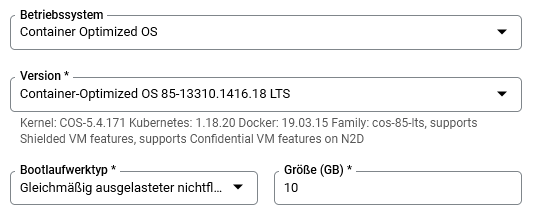

Als Firewall Regel füge ich die Instanz die Tags "Allow HTTP und HTTP Traffic" hinzu. Somit können die Container HTTP Traffic empfangen.

Quelle: <https://cloud.google.com/container-optimized-os/docs/how-to/run-container-instance?hl=de>

      docker-credential-gcr configure-docker --registries europe-west6-docker.pkg.dev

Anschliessend kann ich die Images auf den Host herunterladen

      docker run -d -p 80:80 europe-west6-docker.pkg.dev/symmetric-hull-345606/docker-repo/zuerifrontend 
      docker run -d -p 8080:8080 europe-west6-docker.pkg.dev/symmetric-hull-345606/docker-repo/zueriapi      

Anschliessend laufen beide Container:

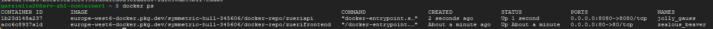

Um Änderungen auf den Websiten zu machen, muss man nun einfach das Image neu bauen und anschliessend auf die Registry pushen.

### 5.3 Python Script konfigurieren

**Python Scripts: <https://github.com/eliagarzi/zuericloudmonitoring/tree/main/clients>**

Zuerst müssen die benötigten Python Modul installiert werden:

      pip3 install requests

Das Python Script, welche den Status ausliest und an die API sendet, soll automatisch beim hochfahren der VM gestartet und als Hintergrundprozess laufen.

      Script in /bin kopieren

      @reboot python3 /bin/status.py &

Die API empfängt nun die Daten

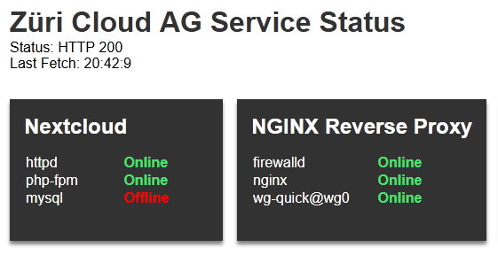

Wenn ich einen Service starte, wird dies so im Frontend aktualisiert

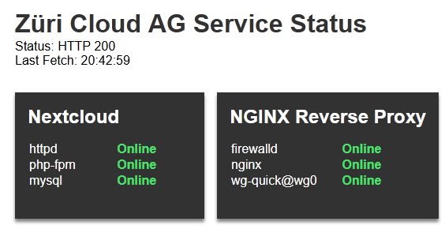

## 7 Testing

| Szenario                                                                        | Erwartet                 | Testergebnis             | Ok |
|---------------------------------------------------------------------------------|--------------------------|--------------------------|----|
| curl 127.0.0.1 auf Frontend Container                                           | Index.html               | Index.html               | Ok |
| <http://zuericloud.ch/status>                                             | Index.html               | Cannot Get /status/      | NOK|
| <http://zuericloud.ch>                                                    | Startseite Zuericloud AG | Startseite Zuericloud AG | Ok |
| GET Request mit Postman an  <http://zuericloud.ch/api/status/all?apikey>= | Service: No Data         | Service: No Data         | Ok |
| POST Request mit Postman an  <http://zuericloud.ch/api/status/all?apikey>=| HTTP 200 und anzeige im Frontend |  HTTP 200 und anzeige im Frontend                |    |
| <http://zuericloud.ch/nextcloud>                                          | Nextcloud Login          | Nextcloud Login          | OK|

Mit Postman kann ich überprüfen, ob die API bereits funktioniert:

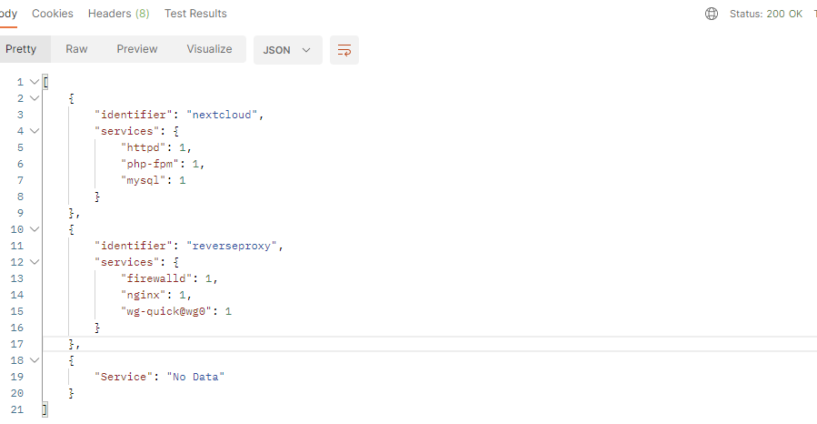

## 7.1 Problem mit /status Seite

Die /status Seite wird vom Reverse Proxy an den dahinterliegenden Frontend Container geleitet. Dieser hat zwei möglichkeiten. Hier muss ich das Verzeichnis für die API mit einem alias und nicht mit root setzen.

**Unterschied root und alias in Nginx:**

Konfiguration mit Root:

        location /status {
            root /usr/share/nginx/html/api;
            autoindex on;
        }

Das Root-Directory würde hier um den /location erweitert werden. Sprich, Ningx würde die Dateien in diesem Pfad suchen:

      /usr/share/nginx/html/api/status

Konfiguration mit Alias:

        location /status {
            alias /usr/share/nginx/html/api;
            autoindex on;
        }

Beim Alias spielt /location allerdings nur soweit eine Rolle, um die Pfad Angabe in der URL zu bestimmen. Der Alias eignet sich, wenn /location nicht den gleichen Namen wie der reale Pfad auf dem Server besitzt. Beim Alias wäre der Pfad also:

/usr/share/nginx/html/api

Quelle: <https://stackoverflow.com/questions/10631933/nginx-static-file-serving-confusion-with-root-alias>