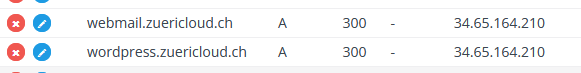

# Mailserver mit SMTP, IMAP und Webmail Service installieren

## Inhaltsverzeichnis
- [Mailserver mit SMTP, IMAP und Webmail Service installieren](#mailserver-mit-smtp-imap-und-webmail-service-installieren)
  - [Inhaltsverzeichnis](#inhaltsverzeichnis)
  - [1 Planung Mailserver](#1-planung-mailserver)
  - [2 Bestandteile eines Mailserver](#2-bestandteile-eines-mailserver)
    - [2.1 SMTP - Postfix](#21-smtp---postfix)
    - [2.2 LMTP - Dovecot](#22-lmtp---dovecot)
    - [2.3 IMAP / POP3 - Dovecot](#23-imap--pop3---dovecot)
  - [3 Sicherheit von E-Mail](#3-sicherheit-von-e-mail)
    - [3.1 Gefahren von E-Mail Servern](#31-gefahren-von-e-mail-servern)
    - [3.2 STARTTLS und SSL/TLS](#32-starttls-und-ssltls)
    - [3.3 Authentifizierung - SASL](#33-authentifizierung---sasl)
    - [3.4 Mail Relaying verhindern](#34-mail-relaying-verhindern)
  - [4 Vorbereitung der Installation - DNS](#4-vorbereitung-der-installation---dns)
    - [4.1 Kauf einer Domain](#41-kauf-einer-domain)
    - [4.2 A und MX-Record](#42-a-und-mx-record)
    - [4.3 PTR Record](#43-ptr-record)
    - [4.4 SPF Record](#44-spf-record)
    - [4.5 DKIM signing](#45-dkim-signing)
    - [4.6 DMARC record](#46-dmarc-record)
  - [5 iRedmail installation](#5-iredmail-installation)
    - [5.1 Was ist iRedmail?](#51-was-ist-iredmail)
    - [5.2 Vorraussetzungen](#52-vorraussetzungen)
    - [5.3 Port 25](#53-port-25)
    - [5.4 Basisinstallation](#54-basisinstallation)
    - [5.5 Einrichten eines SMTP-Relays](#55-einrichten-eines-smtp-relays)
      - [5.5.1 Sender Identity erstellen](#551-sender-identity-erstellen)
      - [5.5.2 SMTP Relay auf Postfix installieren](#552-smtp-relay-auf-postfix-installieren)
    - [5.6 Anpassungen an Postfix oder Dovecot vornehmen](#56-anpassungen-an-postfix-oder-dovecot-vornehmen)
  - [6 Webmail einrichtung](#6-webmail-einrichtung)
    - [6.1 Certbot](#61-certbot)
  - [7 Testing](#7-testing)
  - [8 Probleme](#8-probleme)
    - [Connection zu anderen SMTP-Server Timed out](#connection-zu-anderen-smtp-server-timed-out)
  - [9 Learnings](#9-learnings)
  - [10 Quellen](#10-quellen)

## 1 Planung Mailserver

Bevor man mit der Umsetzung eines Mailservers beginnen kann, sollte man diesen Planen. Für das Modul wird es kein vollumfänglicher Mail-Server mit Veteilern, Kalender oder Kontakten. Es soll ein einfacher Mailserver sein, der unter mx1.zuericloud.ch läuft. Über den SMTP Dienst werden E-Mails gesendet und empfangen. Über den IMAP-Dienst sollen diese im Roundcube Webmail zugänglich werden.

In meinem Fall sieht der Maildienst so aus:

**DNS:**

- Domainnamen z.B. zuericloud.ch
- Hostnamen des Mailservers als MX-Record
- PTR-Record vom Mailserver auf seinen öffentlichen Hostnamen
- Subdomain als Hostname für den Mailserver z.B. mx1.zuericloud.ch
- SPF und DKIM TXT-Records

**Netzwerk:**

Webserver:

- Port 80/TCP
- Port 443/TCP

SMTP:

- 25/TCP
- 587/TCP

POP3:

- 110/TCP
- 995/TCP

IMAP:

- 143/TCP
- 993/TCP

**Hardware:**

- Ubuntu 20.04 LTS
- Min. 4 GB Ram

**iRedMail:**

- Postfix als SMTP-Server
- Dovecot als LMTP und IMAP Server
- Roundcube als Webmail Client (Läuft als Container)

## 2 Bestandteile eines Mailserver

Wenn man mit Webservern arbeitet, ist es gut zu wissen, aus welchen Bestandteilen ein solcher Service besteht. 

### 2.1 SMTP - Postfix

Das SMTP Protokoll ist für die Kommunikation unter Mail Transfer Agents zuständig. Es sorgt also dafür, dass eine E-Mail von einer Domain an eine andere Domain geliefert werden kann.

### 2.2 LMTP - Dovecot

Das LTMP (Local Mail Transfer Procotol) ist dafür zuständig, Informationen zwischen dem SMTP und dem IMAP Server auszutauschen. In meinem Falle wird LMTP von Dovecot genutzt.

Dovecot nutzt hier entweder einen TCP/IP oder Unixsocket. Ersters wenn der SMTP und der IMAP Server nicht auf demselben linux-Server sind und Unixsockets, wenn die Server auf der gleichen Maschine sind. Unixsockets erlauben die Kommunikation zwischen zwei Unix-Prozessen.

### 2.3 IMAP / POP3 - Dovecot

Das IMAP Protokoll ist dafür zuständig, dass die E-Mails zu den entsprechenden Usern gelangen. Man spricht hier vom Mail Delivery Agent.

POP3 ist ebenfalls ein Protokoll, welches E-Mails an die Inboxen weiterleitet. Es ist aber älter und hat einige Nachteile. Bei IMAP werden Nachrichten zwischen IMAP-Server und E-Mailclient wie Outook synchronisiert, bei POP3 werden die Nachrichten auf dem Server gelöscht und nur noch auf dem Client gespeichert.

## 3 Sicherheit von E-Mail

Mailserver müssen sich sein, da diese aus dem Internet erreichbar sind und über diese sensitive Daten gesendet und empfangen werden. Gleichzeitig ist ein Mailserver auch ein beliebter Angriffpunkt, da er wie eine Brücke zwischen dem Internet und den Mailclients auf den Computern einer Firma/einer Privatperson ist.

### 3.1 Gefahren von E-Mail Servern

- Unverschlüsselte Nachrichten von SMTP zu SMTP Server
- Unverschlüsselte Nachrichten vom Client an Mail-Server
- Unerlaubtes Mail Relaying

### 3.2 STARTTLS und SSL/TLS

Zwischen STARTTLS und SSL/TLS gibt es einen Unterschied:

- Bei STARTTLS wird der Verbindungsaufbau im Klartext wiedergegeben. STARTTLS ist kein eigenständiges Protokoll so wie TLS. Es ist lediglich ein SMTP Kommando. Hier fragt der Client den Server, ob dieser eine Verschlüsselung anbietet. Wenn der Server diese Möglichkeit hat, beginnt ab hier eine verschlüsselte Verbindung. Es wird also ein "Upgrade" von einer unverschlüsselten auf eine verschlüsselte Verbindung gemacht. Der Aufbau ist ähnlich wie HTTP.

- Bei SSL/TLS ist die Verbindung von Beginn an verschlüsselt.

**Es ist dadurch zu bevorzugen SSL/TLS und nicht STARTTLS zu nutzen**

### 3.3 Authentifizierung - SASL

Für die Authentifizierung wird SASL genutzt. SASL ist ein Framework und kein Protokoll, welches verschiedene Mechanismen zu authentifizierung umfasst. Die Idee von SASL ist die Trennung von Anwendungsprotokoll (z.B. IMAP, LDAP oder SMTP) und Authentifizierung. Es soll so möglich sein, dass ein Anwendungsprotokoll sehr einfach Authentifizierung implementieren kann.

### 3.4 Mail Relaying verhindern

Ein Mail Relay ist ein offener Mailserver, der ohne authentifizierung Mails empfängt und an andere SMTP-Server weiterleitet. Relaying in Postfix kann durch verschiedene Einstellungen unterbunden werden.

- Domain für den Server setzen.
- Netzwerke begrenzen, die von Clients verwendet werden dürfen. Über den mynetworks Parameter in Postfix kann eingestellt werden, welche Netzwerke als "trusted" gelten, und welche nicht. Postfix lässt nur trusted SMTP-Clients das Relaying über den SMTP-Server zu.

## 4 Vorbereitung der Installation - DNS

DNS und E-Mail arbeiten eng zusammen, um die Vorgaben von Google bezüglich der Sicherheit von E-Mails einzuhalten, muss man verschiedene Einträge in der eigenen Domaine hinterlegen. Darunter z.B. MX-Records oder TXT-Records, welche die SPF und DMARC Signings enthalten.

Anfangs habe ich die Subdomain zuericloud.ddns.net genutzt, diese ist gratis und bei Noip.com erhältlich. Bei Noip kann ich aber all diese Records nicht hinterlegen. Ich habe mir hierfür also eine Domain für 5 Franken bei Hostpoint.de gekauft: zuericloud.ch.

### 4.1 Kauf einer Domain

Die Domain habe ich für 5 Franken bei Hostpoint gekauft. Sie ist 1 Jahr gültig und ich kann hier alle DNS-Einträge hinterlegen.

Wichtig beim Kauf einer Domain ist es, zu schauen, dass diese nicht zuvor z.B. für Phishing genutzt wurde und auf Blacklists gelistet ist. Dies verringert wiederum die Wahrscheinlichkeit im Spam zu landen.

Mit mxtoolsbox.com kann man verschiedene Dinge bezüglich Mailservern online testen. Es erlaubt auch das durchsuchen der eignene Domain in Blacklisten. 

<https://mxtoolbox.com/SuperTool.aspx?action=blacklist%3azuericloud.online&run=toolpage>

### 4.2 A und MX-Record

Mit der neuen Domain1r muss ich einige Dinge an der bestehenden DNS-Konfiguration ändern.

Damit der Mailserver richtig funktioniert, muss ich das Zonenfile für zuericloud.ch anpassen.

**Zonenfile bearbeiten:**

- Der A-Record für zuericloud.ch muss auf die statische IP-Adresse des Reverse Proxy zeigen

- Der A-Records für mx1.zuericloud.ch muss auf die statische IP-Adresse des Mailservers zeigen

- Der MX-Record für zuericloud.ch muss auf mx1.zuericloud.ch zeigen

### 4.3 PTR Record

Der PTR Record ist ein "Reverse-DNS" Record, dieser löst also eine IP-Adresse in einen Domainnamen auf.

Diesen muss ich auf der Google Cloud konfigurieren. Damit dies Möglich ist, muss ich beweisen, dass die Domain zuericloud.ch mir gehört.

1. Hierzu muss man im Google Webmaster eine neue Property erstellen
2. Anschliessend muss man im Zonenfile einen neuen TXT-Record mit dem von Google Generierten String erstellen

3. Danach muss man ca. 1 Minute warten und die Domain wird als eigene Property bestätigt.

4. Danach kann ich in meiner VM-Instanz die Domain als PTR-Domain hinterlegen. Wenn die Domain über den Webmaster bestätigt wurde, kann die Domain nun in eine IP-Adresse aufgelöst werden

### 4.4 SPF Record

SPF steht für Sender Policy Framework und wird genutzt, um die IP-Adresse des Mailservers zu validieren. Im SPF werden die IP-Adresse der Mailserver erfasst, die unter der Domain E-Mails versenden dürfen. Wenn die IP-Adresse im Mail-Header nicht mit den IP-Adressen im SPF-Record übereinstimmt, wird die E-Mail als Spam gekennzeichnet und von bestimmten System ganz in die Quarantäne verschoben.

Mit mxtoolbox.com habe ich einen SPF Record generieren lassen.

https://mxtoolbox.com/SPFRecordGenerator.aspx?domain=zuericloud.ch

    Type: TXT
    Host/Name: zuericloud.ch
    Value: v=spf1 ip4:34.65.169.233 -all

### 4.5 DKIM signing

DKIM steht für DomainKeys Identified Mail. Es soll Spam oder Phishing Mails dadurch verhindern, dass die genutze Domain authentifiziert wird.

Für DKIM wird dabei ein TXT-Record in der DNS-Zone hinterlegt. Ebenso wird jede E-Mail mit einem DKIM Header versehen. Konrekt funktioniert die Authentifizierung durch Public/Private Keys. E-Mails werden vom Sender mit dem eigenen Private Key signiert. Der Empfänger kann nun die E-Mail durch den Public Key, der im DKIM TXT-Record der DNS-Zone hinterlegt ist, die Mail verifizieren.

### 4.6 DMARC record

DMARC steht für Domain-based Message Authentification, Reporting and Conformance. DMARC baut auf SPF und DKIM auf und soll den Missbrauch von E-Mail verhindern. DMARC definiert hier Richtlinien, welche im Zonenfile als TXT-Record hinterlegt werden.

## 5 iRedmail installation

### 5.1 Was ist iRedmail?

iRedmail ist eine Mailumgebung bestehend auf Postfix und Dovecot. Sie vereinfacht die Konfiguration und Administration. 

### 5.2 Vorraussetzungen

- Neu installiertes Betriebssystem
- Port 25 ist offen (Siehe Abschnitt unten)
- 4 GB Ram

### 5.3 Port 25

Der Port 25 wird von den meisten Cloud-Providern standardmässig blockiert, um das Senden von Spam aus den eigenen Netzwerken zu verhindern. Dies trifft auch auf die Google Cloud Platform zu. Es ist also nicht möglich, aus einer GCP-Instanz E-Mails zu versenden. Es ist aber mölich, Mails auf den Ports 25, 465 und 587 zu empfangen.

Google stellt allerdings einen Workaround bereit: Man muss die Mails von der Instanz über einen Mailrelay Dienst wie Sendgrid senden.

https://cloud.google.com/compute/docs/tutorials/sending-mail?hl=de
https://cloud.google.com/compute/docs/tutorials/sending-mail/using-sendgrid?hl=de

Unter Postfix/iRedMail lassen sich ebenfalls Relayhosts einrichten:

https://docs.iredmail.org/relayhost.html

Ich werde also Sendgrid als Relayhost nutzen, damit ich trotz der Beschränkung der Google Cloud Platform E-Mails versenden kann.

### 5.4 Basisinstallation

Die neuerstellte Instanz updaten & upgraden

    apt-get update && upgrade -y 

Hostname setzen

    /etc/hostname: mx1.zuericloud.ch 
    /etc/hosts: 127.0.0.1: mx1.zuericloud.ch localhost

Server neustarten, damit die Änderungen entgültig werden

    sudo reboot -h 0

Den Hostnamen des Servers überprüfen

    hostname -f 
    mx1.zuericloud.ch

Download der iRedMail Dateien

    curl -LO https://github.com/iredmail/iRedMail/archive/refs/tags/1.5.2.tar.gz

Entpacken des Tarballs

    tar xzvf 1.5.2.tar.gz

Starten des Installers

    cd iRedMail-1.5.2/

    bash iRedmail.sh 

Store für Mailboxen: /var/vmail

    Webclient: Nginx

    Backend: MariaDB

    Mysql root Passwort: root123

    Mail Domain Name: zuericloud.ch

    Mail Domain Administrator: admin123

    * Storage base directory:               /var/vmail
    * Mailboxes:                            
    * Daily backup of SQL/LDAP databases:   
    * Store mail accounts in:               MariaDB
    * Web server:                           Nginx
    * First mail domain name:               zuericloud.ch
    * Mail domain admin:                    postmaster@zuericloud.ch
    * Additional components:                Roundcubemail netdata iRedAdmin Fail2ban

https://docs.iredmail.org/letsencrypt.html

https://docs.iredmail.org/relayhost.html

### 5.5 Einrichten eines SMTP-Relays

Sendgrid hat für Nutzung über die Google Cloud Platform einen Free Tier. Diesen muss man im GCP-Marketplace aktivieren. Anschliessend wird man auf die Seite von Sendgrid weitergeleitet. Hier muss man ein Konto erstellen und anschliessend eine sogenannte Sender Identity erstellen.

#### 5.5.1 Sender Identity erstellen

Damit man E-Mails über die Sendgrid Server relayen kann, muss man eine Sender-Identität erstellen. Als Sender-Identität gilt entweder eine bestimmte E-Mail Adresse oder eine ganze Domain. Ich erstelle eine Identität für die gesamte Domain.

Hierfür muss ich im Zonenfile für Zuericloud.ch drei CNAME Records erfassen:

#### 5.5.2 SMTP Relay auf Postfix installieren

Für die Konfiguration benötigt man Root-Rechte

    sudo su

Man muss sicherstellen, dass alle von nun an erstellen Dokumente die Berechtigung 077 haben.

    umask 077

In der Postfix Konfiguration muss man folgende Dinge einstellen:

    vi /etc/postfix/main.cf 
 
    # default_transport = error
    # relay_transport = error

Anschliessend muss man einen permanenten Relayhost konfigurieren, somit werden alle E-Mails und nicht nur bestimmte über den Relayhost gesendet.

    relayhost = [smtp.sendgrid.net]:2525
    smtp_tls_security_level = may
    smtp_sasl_auth_enable = yes
    smtp_sasl_password_maps = hash:/etc/postfix/sasl_passwd
    header_size_limit = 4096000
    smtp_sasl_security_options = noanonymous

Anschliessend muss man ein neues SASL Login erfassen. Hierfür benötigt man den API Key von Sendgrid.

    echo [smtp.sendgrid.net]:2525 apikey:APIKEY >> /etc/postfix/sasl_passwd

Anschliessend kann man mit Postmap eine neue .db Datei generieren

    postmap /etc/postfix/sasl_passwd

Die alte Passwortdatei (SASL ist bereits installiert) löschen

    rm /etc/postfix/sasl_passwd

Auf die neue Passwortdatei muss man die Berechtigung 600 setzen

    chmod 600 /etc/postfix/sasl_passwd.db

Anschliessend muss man Postfix neustarten

    systemctl restart postfix

Anschliessend sollten alle E-Mails über den Relayhost gesendet werden.

Im Logfile /var/log/maillog überprüfen, ob es beim Senden der Nachricht eine Fehlermeldung gibt.

Mail Header:

### 5.6 Anpassungen an Postfix oder Dovecot vornehmen

**Postfix:**

- Über den Postconf Befehl: postconf -e "Einstellung=wert"
- Speicherort der Dienst-Konfiguration: /etc/postfix/main.cf
- Speicherort für die Konfiuration des Masterprozesses: /etc/postfix/master.cf

**Dovecot:**

- /etc/dovecot/conf.d/dovecot.conf

## 6 Webmail einrichtung

Der Mailservice soll über mail.zuericloud.ch erreichbar sein. Ebenfalls soll die Verbindung mit HTTPS funktionieren. Das DNS-Zonenfile wurde so konfiguriert, dass ein Aufruf auf mail.zuericloud.ch mit der IP-Adresse des Webservers beantwortet wird.

### 6.1 Certbot

Damit die Seite über HTTPS erreichbar ist, habe ich ein neues Let's Encrypt Zertifikat mit Certbot austellen lassen.

sudo certbot --nginx -d mail.zuericloud.ch

## 7 Testing

Dies ist noch kein endgültiges Testing. Es geht darum, die grundsätzliche Funktionalität zu testen, bevor ich den SMTP-Relay einrichte.

**Ports:**

Um sicherzustellen, dass alle nötigen Ports geöffnet sind, mache ich einen Portscan mit Nmap:

    25/tcp   open   smtp
    80/tcp   open   http
    443/tcp  open   https
    465/tcp  open   smtps
    587/tcp  open   submission

**E-Mail senden von G-Mail:**

Eine E-Mail per GMail senden an postmaster@zuericloud.ch und anschliessend im Webmail überprüfen, ob die Email erhalten wurde.

**Webmail:**

Über mail.zuericloud.ch mit Postmaster@zuericloud.ch anmelden und admin123 anmelden.

## 8 Probleme

### Connection zu anderen SMTP-Server Timed out

Bevor ich die Mailumgebung mit iRedmail aufgesetzt habe, habe ich nur Postfix aufgesetzt, damit ich weiss, was bei der Installation passiert. Nach der Installation von Postfix wollte ich dieses über Telnet testen. Dies hat soweit auch alles funktioniert. Die Nachricht wurde mit einem Code 250 erfolgreich an den Server übergeben.

Mit Telnet localhost 25

      HELO zuericloud.ch

      MAIL FROM: lokaler-benutzer@zuericloud.ch

      RCPT TO: Ziel-E-Mail

      DATA
      Subject: Test
      This is a Test 
      .

Unter /var/log/maillog konnte ich folgende Fehlermeldung feststellen

      connect to gmail-smtp in.l.google.com[74.125.142.26]:25: Connection timed out

Connection timed out bedeutet, dass auf Layer 4 nicht auf ein TCP Syn mit Syn oder Syn Ack geantwortet wurde. Dies legt die Vermutung offen, dass der Port 25 auf dem eignen Server nicht offen ist. Der Port war jedoch in der Instanz und auch in der GCP geöffnet. 

Nach einiger Recherche fand ich heraus, dass Google den Mailausgang zu anderen SMTP-Server über Port 25 blockiert. Dies um Spam aus dem eignen IP-Adressblock zu vermeiden.

Mit nmap konnte ich meinen Verdacht bestätigen:

      PORT     STATE  SERVICE
      25/tcp   closed smtp

## 9 Learnings

**Port 25 von vielen Serviceprovidern geblockt:**

Was ich nicht wusste: Der Port 25 wird von vielen Hosting und Cloudprovidern geblockt. Dies macht auch Sinn, denn über den Port 25 kann man auch Spam versenden. Und Spam aus den eignen IP-Bereichen verschlechtert die IP-Reputation.

**LMTP:**

LMTP ist das Protokoll, welches den MTA (Mail Transport Agent) und den MDA (Mail Delivery Agent) verbindet. Es ermöglicht die Kommunikation zwischen den beiden Diensten entweder über einen TCP/IP- oder Unixsocket

**Unixsockets:**

Unixsockets sind eine möglichkeit, wie Prozesse unter Linux miteinander kommunizieren können.

## 10 Quellen

https://www.cyon.ch/support/a/spf

https://www.ionos.de/digitalguide/e-mail/e-mail-sicherheit/was-ist-ein-spf-record/

https://www.cloudflare.com/learning/dns/dns-records/dns-dkim-record/

https://cloud.google.com/compute/docs/tutorials/sending-mail/using-sendgrid?hl=de#debian_3

https://docs.iredmail.org/letsencrypt.html

https://docs.iredmail.org/relayhost.html

https://doc.dovecot.org/configuration_manual/howto/postfix_and_dovecot_sasl/

https://access.redhat.com/documentation/en-us/red_hat_enterprise_linux/8/html/deploying_different_types_of_servers/assembly_mail-transport-agent_deploying-different-types-of-servers

https://access.redhat.com/documentation/en-us/red_hat_enterprise_linux/8/html/deploying_different_types_of_servers/assembly_installing-and-configuring-dovecot-for-imap-and-pop3_deploying-different-types-of-servers

https://www.redhat.com/sysadmin/install-configure-postfix
https://access.redhat.com/documentation/en-us/red_hat_enterprise_linux/7/html/selinux_users_and_administrators_guide/chap-managing_confined_services-postfix
