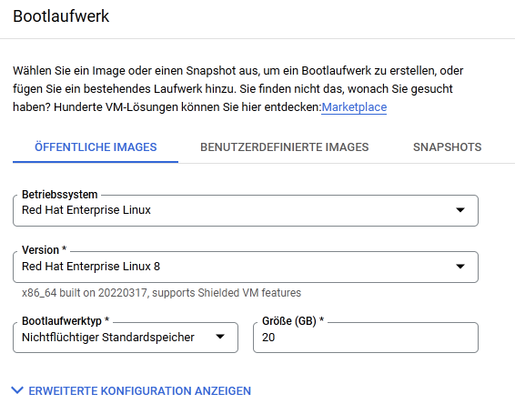
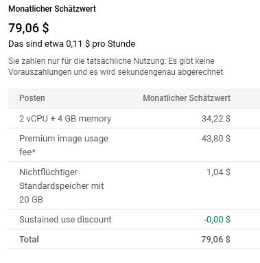
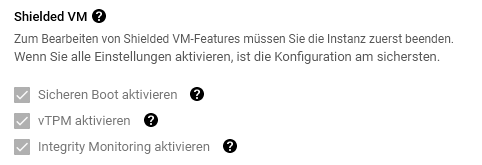
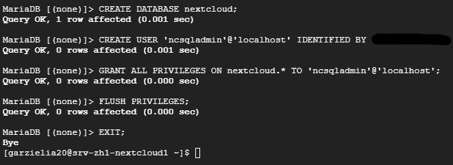
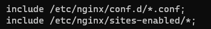
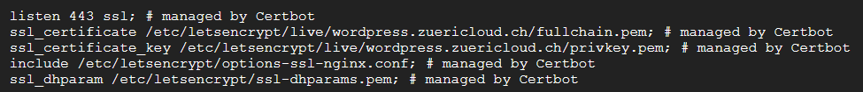
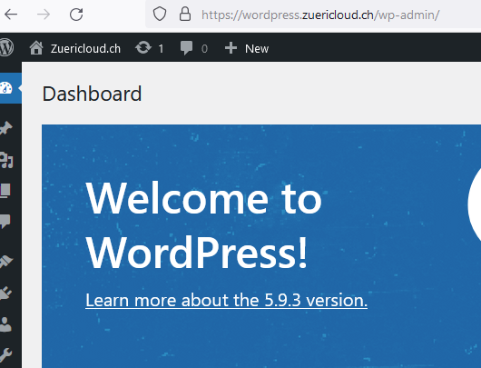

# Weiteren Webservice in Betrieb nehmen

In diesem Teil soll ein weiterer Webdienst in Betrieb genommen werden. Ich habe mich hier für Nextcloud, ein selbstgehosteter Cloudspeicher, und Roundcube Webmail entschieden.

## Inhaltsverzeichnis
- [Weiteren Webservice in Betrieb nehmen](#weiteren-webservice-in-betrieb-nehmen)
  - [Inhaltsverzeichnis](#inhaltsverzeichnis)
  - [1 Übersicht Nextcloud](#1-übersicht-nextcloud)
  - [2 Konfiguration VM auf GCP](#2-konfiguration-vm-auf-gcp)
    - [Sicherheit der virtuellen Maschine](#sicherheit-der-virtuellen-maschine)
  - [3 Serviceintegration](#3-serviceintegration)
    - [3.1 Einbindung Nextcloud in den Reverse Proxy](#31-einbindung-nextcloud-in-den-reverse-proxy)
    - [3.2 Einbindung Nextcloud in die Status API](#32-einbindung-nextcloud-in-die-status-api)
  - [4 Installation Nextcloud](#4-installation-nextcloud)
    - [4.1 Konfiguration Apache](#41-konfiguration-apache)
  - [5 Probleme](#5-probleme)
    - [5.1 PHP 7.2](#51-php-72)
    - [5.2 Internal Server Error](#52-internal-server-error)
    - [5.3 PHP-Modul nicht installiert](#53-php-modul-nicht-installiert)
  - [5.4 Erstes Testing](#54-erstes-testing)
  - [6 Wordpress Installation](#6-wordpress-installation)
    - [6.1 Docker Compose Umgebung mit 2 Container](#61-docker-compose-umgebung-mit-2-container)
    - [6.2 Wordpress VM Installation mit Nginx](#62-wordpress-vm-installation-mit-nginx)
  - [7 Wordpress Container](#7-wordpress-container)
    - [7.1 Umgebungsvariablen](#71-umgebungsvariablen)
    - [7.2 Mehrere Datenbanken automatisiert aufsetzen](#72-mehrere-datenbanken-automatisiert-aufsetzen)
  - [8 Dockerisieren einer PHP-Applikation](#8-dockerisieren-einer-php-applikation)
    - [8.1 Probleme](#81-probleme)
      - [8.1.1 Call to undefined function mysql_connect()](#811-call-to-undefined-function-mysql_connect)
      - [8.1.2 Container startet ständig neu](#812-container-startet-ständig-neu)
    - [8.2 Vorbereitung Nginx Reverse Proxy](#82-vorbereitung-nginx-reverse-proxy)
    - [8.3 Weiteres SSL-Zertifikat für Wordpress austellen](#83-weiteres-ssl-zertifikat-für-wordpress-austellen)
    - [8.4 Installation Wordpress](#84-installation-wordpress)

## 1 Übersicht Nextcloud

Nextcloud ist ein selbstgehosteter Cloudspeicher-Alternative. Interessant ist Nextcloud für dieses Modul, da es für Nextcloud auch einen E-Mail Client gibt. Das Ziel ist es, diesen Mailclient mit dem Mailserver zu nutzen.

Ich installiere Nextcloud auf der Compute Enginge der Google Cloud. Es handelt sich dabei um eine Virtuelle Maschine, da Nextcloud aktuell nur für Virtuelle Maschinen optimiert ist.

Als Betriebssystem nutze ich Red Hat Enterprise Linux 8. Ich nutze RHEL8 für Nextcloud, da ich gerne mehr Erfahrung mit dem Betriebssystem sammeln möchte.

**Services:**

- Apache2 Webserver
- PHP7 Preprocessor
- MySQL Datenbankserver

## 2 Konfiguration VM auf GCP
***
Auch für diese VM nutzt ich wieder Red Hat Enterprise Linux 8.

**Kosten der VM:**

### Sicherheit der virtuellen Maschine

**Löschschutz:**

Auf die VM wird ein Flag gesetzt, welches es verhindert, dass die VM unbeabsichtigt gelöscht wird.

**Shielded VM:**

- Hier habe ich Secure Boot aktiviert. So kann der Schaden durch Rootkits vermindert werden.
- Mit vTPM wird ein virtualisiertes Trusted Platform Module eingesetzt. Dieses wird z.B. zur Speicherung von Schlüsseln genutzt.

## 3 Serviceintegration
***
- Nginx Reverseproxy
- Erreichbar über das Web
- Integration in den Monitoring Service

Bevor ich Nextcloud installieren kann, muss ich sicherstellen, dass der Server richtig im Netzwerk eingebunden ist und später auch erreichbar ist.

### 3.1 Einbindung Nextcloud in den Reverse Proxy

**Dokumentation Reverse Proxy: <https://gitlab.com/eliagarzi/test/-/blob/main/SW1/README.md#3-nginx-reverseproxy>***

Nextcloud soll über **zuericloud.ch/nextcloud** erreichbar sein. Hierfür muss ich einen neuen Location Eintrag auf dem Nginx Reverse Proxy machen.

Im File /etc/nginx/nginx.conf auf dem Reverse Proxy eine neue Location erstellen, die Pakete auf den Nextcloud Server weiterleitet.

        location /nextcloud {
                proxy_pass         http://10.172.0.4:80;
                proxy_http_version 1.1;
                proxy_set_header   Upgrade $http_upgrade;
                proxy_set_header   Connection keep-alive;
                proxy_set_header   Host $host;
                proxy_cache_bypass $http_upgrade;
                proxy_set_header   X-Forwarded-For $proxy_add_x_forwarded_for;
                proxy_set_header   X-Forwarded-Proto $scheme;
        }

### 3.2 Einbindung Nextcloud in die Status API

Nextcloud soll JSON Daten auf **zuericloud.ch/api** senden. Diese sollen unter **zuericloud.ch/status** dargestellt werden.

Hierzu habe ich das Python Script mit den richtigen Services entsprechend angepasst. Anschliessend habe ich das Script so konfiguriert, dass es mit Cron automatisch beim Startup gestartet wird und als Hintergrundprozess läuft.

## 4 Installation Nextcloud
***
Um später die Datei entpacken und das Zip von Nextcloud herunterzuladen, installiere ich wget und unzip

      sudo yum install wget unzip

Installation von Apache, Apache-HTTPS, MariaDB-Datenbankserver sowie PHP und PHP-SQL Anbindung.

      sudo yum install httpd mod_ssl mariadb-server php php-mysqlnd

Installation der benötigten PHP Module

      sudo yum install php-zip php-dompdf php-xml php-mbstring php-gd php-curl php-imagick php-intl php-bcmath php-gmp libmagickcore-6.q16-6-extra unzip

Starten der MariaDB Server Konfiguration

      sudo mysql_secure_installation

      sudo mysql -u root -p

        

Download des Nextcloud Archives

      wget https://download.nextcloud.com/server/releases/latest.zip 

Entpacken und ins Verzeichnis /usr/share verschieben

      unzip latest

      sudo mv nextcloud /usr/share

Ein Verzeichnis für die Daten erstellen

      mkdir /usr/share/nextcloud/storage

Nextcloud die richtigen Berechtigungen für das /usr/share/nextcloud Verzeichnis geben

      chown -R apache:apache /usr/share/nextcloud/*

      chcon -t httpd_sys_rw_content_t /usr/share/nextcloud/ -R

Nextcloud kann nun unter zuericloud/nextcloud konfiguriert werden

Quelle: <https://docs.nextcloud.com/server/latest/admin_manual/installation/index.html>

### 4.1 Konfiguration Apache

**Meine Konfiguration: <https://gitlab.com/eliagarzi/test/-/blob/main/Konfiguration/Nextcloud/nextcloud.conf>**

    <VirtualHost *:80>
        ServerAdmin master@domain.com
        DocumentRoot /usr/share/nextcloud/
        ServerName zuericloud.ch/nextcloud
      
        Alias /nextcloud "/usr/share/nextcloud/"
        <Directory /usr/share/nextcloud/>
            Options +FollowSymlinks
            AllowOverride All
            Require all granted
              <IfModule mod_dav.c>
                Dav off
              </IfModule>
            SetEnv HOME /usr/share/nextcloud/
            SetEnv HTTP_HOME /usr/share/nextcloud/
        </Directory>
        ErrorLog /var/log/nextcloudserver/error.log
        CustomLog /var/log/nextcloudserver/access.log combined
    </VirtualHost>

In meiner Konfiguration sind die Logfiles für den Nextcloud Virtualhost hier gespeichert:

- /var/log/nextcloudserver/error.log

- /var/log/nextcloudserver/access.log

Apache Hauptkonfiguration: **/etc/httpd/conf/httpd.conf**

Pfad für Virtual-Hosts: **/etc/httpd/conf.d/**

In der Hauptkonfiguration werden mit **IncludeOptional conf.d/*.conf** alle Konfiguration aus **/etc/httpd/conf.d/** geladen.

Quelle Red Hat Dokumentation: <https://access.redhat.com/documentation/zh-cn/red_hat_enterprise_linux/8/html/deploying_different_types_of_servers/configuring-apache-name-based-virtual-hosts_setting-apache-http-server>

## 5 Probleme
***
### 5.1 PHP 7.2

Nach der Konfiguration von Apache habe ich folgenden Fehler erhalten, wenn ich auf **zuericloud.ch/nextcloud/** verbinde:

      This version of Nextcloud requires at least PHP 7.3
      You are currently running 7.2.24. Please update your PHP version.

Sowohl die Konfiguration wie auch der Reverse Proxy funktioniert also. Jedoch muss ich eine neuere PHP Version installieren.

      yum install php:7.4

### 5.2 Internal Server Error

Dies war ein Fehler, da Nextcloud nicht die benötigten Zugriffe auf das /usr/share/nextcloud Verzeichnis hatte. Dies kann man anpassen mit:

      chown -R apache:apache /usr/share/nextcloud/*

      chcon -t httpd_sys_rw_content_t /usr/share/nextcloud/ -R

### 5.3 PHP-Modul nicht installiert

Anschliessend erhielt ich die Fehlermeldung die PHP Module gd und zip seien nicht installiert.

      sudo yum install php-gd php-zip

## 5.4 Erstes Testing

| Szenario                                                    | Erwartet               | Ergebnis               | Status |
|-------------------------------------------------------------|------------------------|------------------------|----|
| Nextcloud ist über zuericloud.ch/nextcloud erreichbar | HTTP 200               | HTTP 200               | OK |
| Nextcloud kann auf /usr/share/nextcloud zugreifen           | Setup funktioniert     | Setup funktioniert     | OK |
| Nextcloud SSH ist über Wireguared erreichbar                | SSH Login funktioniert | SSH Login funktioniert | OK |
| Status Script wird automatisch gestartet mit Crontab        | Script sendet Daten    | Script sendet Daten    | OK |
| Status von Nextcloud wird auf /status angezeigt             | Status wird angezeigt  | Status wird angezeigt  | OK |
| Nextcloud hat Zugriff auf apps.nextcloud.com                | Zugriff auf Appstore   | Could not connect to appstore: cURL error 7  | NOK |

## 6 Wordpress Installation
***
Ziel: Mit Docker-Compose eine funktionierende Wordpress Umgebung mit Datenbankserver und Nginx zu haben. Die Images sollen alle selbst über Dockerfiles gebaut werden.

### 6.1 Docker Compose Umgebung mit 2 Container

Um eine Multi-Container Applikation zu erstellen, braucht man ein docker-compose.yml File. In diesem definiert man die Eigenschaften der einzelnen Container.

### 6.2 Wordpress VM Installation mit Nginx

Bevor ich mich an die Installation von Wordpress in der Docker-Compose Umgebung machte, installierte ich Wordpress auf einen Ubuntu Container, um die genauen Schritte zu seheh. Es ist wichtig zu sehen, was sich wie automatisieren lässt und wo ich entsprechende Fragen klären muss.

            docker run -d -t wordpress ubuntu:latest

            docker exec -it Wordpress bash

            apt update

Um den Server später verwalten zu können, braucht es SSH. Zur bearbeitung von Dateien im Container braucht es vim.

            apt install vim nginx openssh-server curl 

            sudo apt install php-curl php-gd php-intl php-mbstring php-soap php-xml php-xmlrpc php-zip

Unter Ubuntu sind

            service nginx restart

            curl -LO https://wordpress.org/latest.tar.gz

            tar xzvf latest.tar.gz

            cp /tmp/wordpress/wp-config-sample.php /tmp/wordpress/wp-config.php

            tar xzvf latest.tar.gz

            sudo cp -a /tmp/wordpress/. /var/www/wordpress

            sudo chown -R www-data:www-data /var/www/wordpress      

## 7 Wordpress Container
***
Danach ist mir die Idee gekommen, dass ich das ganze Eigentlich mit einem Dockerfile automatisieren kann und anschliessend eine Multicontainer Umgebung mit Docker-Compose aufbauen kann, da Wordpress einen Datenbankserver braucht.

Dies war eine spannende Herausforderung, da ich hier mit neuen Dingen konfrontiert war, mit welchen ich bisher nicht gearbeitet habe.

- Umgebungsvariablen (Datenbankname, Passwörter etc.)
- Umgebungsvariablen im wp-conf.php File nutzen
- Automatisiertes Erstellen von mehreren Datenbanken in einen Mysql Container
- Docker Netzwerke & Volumes

### 7.1 Umgebungsvariablen

Wordpress braucht einige Umgbeungsvariablen. Diese bestimmt man über das Docker-compose.yml File unter environment. Unter Debian können Umgebungsvariablen mit **printenv** Abgerufen werden. Unter PHP mit getenv(Name). Das wp-config.php File habe ich so angepasst, dass es die Umgebungsvariablen nimmt, welche man im im Docker-Compose File bestimmt. 

            define('DB_NAME', getenv('DB_NAME'));

            /** Ersetze username_here mit deinem MySQL-Datenbank-Benutzernamen */
            define('DB_USER', getenv('DB_USER'));

            /** Ersetze password_here mit deinem MySQL-Passwort */
            define('DB_PASSWORD', getenv('DB_PASSWORD'));

            /** Ersetze localhost mit der MySQL-Serveradresse */
            define('DB_HOST', getenv('DB_HOST'));

            /** Der Datenbankzeichensatz der beim Erstellen der Datenbanktabellen verwendet werden soll */
            define('DB_CHARSET', 'utf8');

            /** Der collate type sollte nicht geändert werden */
            define('DB_COLLATE', '');

            define('AUTH_KEY',         'put your unique phrase here');
            define('SECURE_AUTH_KEY',  'put your unique phrase here');
            define('LOGGED_IN_KEY',    'put your unique phrase here');
            define('NONCE_KEY',        'put your unique phrase here');
            define('AUTH_SALT',        'put your unique phrase here');
            define('SECURE_AUTH_SALT', 'put your unique phrase here');
            define('LOGGED_IN_SALT',   'put your unique phrase here');
            define('NONCE_SALT',       'put your unique phrase here');

### 7.2 Mehrere Datenbanken automatisiert aufsetzen

In der Compose-Umgebung braucht es zwei Datenbanken. Eine für den Roundcube-Webmail Server und für das Wordpress CMS. Über die Environment Variablen des Mysql Container kann man erste Angaben machen, was für eine Datenbank inkl. User erstellt werden soll. Dies funktioniert in meinem Fall aber nicht, da ich zwei Datenbanken brauche.

Docker führt beim Erstellen des Containers Scripts im folgenden Ordner aus: **/docker-entrypoint-initdb.d/**. Hier habe ich das File database-configuration.sql als Volume gemountet. Beim Erstellen des Mysql-Servers wird also folgendes Script ausgeführt.

            #Datenbanken erstellen
            CREATE DATABASE IF NOT EXISTS `wordpress`;
            CREATE DATABASE IF NOT EXISTS `webmail`;

            #Entsprechenden User erstellen 
            CREATE USER 'wordpress'@'localhost' IDENTIFIED BY 'password';
            CREATE USER 'webmail'@'localhost' IDENTIFIED BY 'password';

            #Rechte verteilen
            GRANT ALL PRIVILEGES ON wordpress TO 'wordpress'@'127.0.0.1';
            GRANT ALL PRIVILEGES ON webmail TO 'webmail'@'127.0.0.1';

Um die Erstellung der Datenbaken zu testen, verbinde ich mit dem Mysql Server

            docker exec -it mysql-container-id bash 

Um hier nun die Erstellten Datenbanken zu sehen, führe ich folgende Kommandos aus 

            mysql -u root -p

            SHOW DATABASES; 

            mysql> SHOW DATABASES;
            +--------------------+
            | Database           |
            +--------------------+
            | information_schema |
            | mysql              |
            | performance_schema |
            | sys                |
            | webmail            |
            | wordpress          |
            +--------------------+

## 8 Dockerisieren einer PHP-Applikation
***
Da ich den Umgang mit Docker üben wollte, habe ich die Roundcube und Wordpress Anwendungen, wie auch alle anderen bisher, selbst als Dockerfile geschrieben und gestestet. Dies war bisher sehr einfach, da es um statische Websiten mit Nginx ging. Roundcube und Wordpress sind aber PHP-Applikationen und demnach ein wenig komplizierter.  

### 8.1 Probleme

#### 8.1.1 Call to undefined function mysql_connect()

Wordpress nutzt MySqli. Eine PHP-Erweiterung um auf SQL-Datenbanksysteme wie MariaDb oder MySql zuzugreifen. Da ich bereits einmal mit MySqli gearbeitet habe, wusste ich, dass man in der Php.ini Datei unter Extension Mysqli aktivieren muss. Es kam jedoch zu folgendem Fehler:

            Fatal error: Uncaught Error: Call to undefined function mysql_connect() in /var/www/html/wordpress/wp-includes/wp-db.php:1788 Stack trace: #0 /var/www/html/wordpress/wp-includes/wp-db.php(724):.....

Nach einiger Recherche Fand ich heraus, dass man die Mysqli Extension seperat bei der Erstellung des Containers installieren muss:

            RUN docker-php-ext-install mysqli && docker-php-ext-enable mysqli

#### 8.1.2 Container startet ständig neu

Nach der Installation der Docker Compose Umgebung musste ich noch verschiedene Dinge anpassen und verbessern. Nach einem neustart des Container-Host starteten alle Container korrekt bis auf den Wordpress Container. Dieser startete ständig neu.

Über die Logs konnte ich folgendes erfahren:

      docker logs --tail 50 --follow --timestamps container-id   

      2022-05-06T15:20:18.755197840Z AH00526: Syntax error on line 2 of /etc/apache2/sites-enabled/wordpress.conf:
      2022-05-06T15:20:18.755235927Z Redirect to non-URL

In die Konfiguration des Apache Servers hatte sich ein Fehler eingeschlichen.

### 8.2 Vorbereitung Nginx Reverse Proxy

Damit Wordpress über wordpress.zuericloud.ch erreichbar ist, muss die Konfiguration des Nginx Reverse Proxy angepasst werden

Auf dem Nginx Server muss ein neuer Serverblock erfasst werden, welcher auf die Domain wordpress.zuericloud.ch hört.

In diesem legen wir fest, dass alle Anfragen die auf wordpress.zuericloud.ch/ reinkommen auf den internen Wordpress-Container weitergeleitet werden.

      server {
            server_name wordpress.zuericloud.ch;
            location / {
                  proxy_pass         http://10.172.0.10:9000;
                  proxy_http_version 1.1;
                  proxy_set_header   Upgrade $http_upgrade;
                  proxy_set_header   Connection keep-alive;
                  proxy_set_header   Host $host;
                  proxy_cache_bypass $http_upgrade;
                  proxy_set_header   X-Forwarded-For $proxy_add_x_forwarded_for;
                  proxy_set_header   X-Forwarded-Proto https; 
            }

### 8.3 Weiteres SSL-Zertifikat für Wordpress austellen

Damit die Subdomain wordpress.zuericloud.ch ebenfalls mit HTTPS funktioniert, muss man für diese Subdomain nochmals ein Zertifikat austellen. 

      sudo certbot --nginx -d wordpress.zuericloud.ch
      
      Saving debug log to /var/log/letsencrypt/letsencrypt.log
      Requesting a certificate for wordpress.zuericloud.ch
      Successfully received certificate.
      Certificate is saved at: /etc/letsencrypt/live/wordpress.zuericloud.ch/fullchain.pem
      Key is saved at:         /etc/letsencrypt/live/wordpress.zuericloud.ch/privkey.pem

### 8.4 Installation Wordpress

Nach der Installation von Wordpress, muss man einen kleinen Setup ausführen. Hier setzt man das Passwort und den Admin-Benutzer. 

Anschliessend ist das Dashboard unter wordpress.zuericloud.ch/wp-admin/ erreichbar.

Login

      admin
      admin123#

https://stackoverflow.com/questions/9300950/using-environment-variables-in-wordpress-wp-config

https://hub.docker.com/_/mysql

https://docs.docker.com/compose/

https://www.nginx.com/resources/wiki/start/topics/recipes/wordpress/

https://www.digitalocean.com/community/tutorial_collections/how-to-install-wordpress-with-nginx

https://www.youtube.com/watch?v=HG6yIjZapSA (Docker Compose Tutorial)