# Testing

## Inhaltsverzeichnis
- [Anforderungen](#anforderungen)
  - [Inhaltsverzeichnis](#inhaltsverzeichnis)
  - [Funktionstests](#funktionstests)
    - [DNS](#dns)
      - [zuericloud.ch](#zuericloudch)
      - [MX-Record wird richtig zurückgegeben](#mx-record-wird-richtig-zurückgegeben)
      - [PTR-Record für mx.zuericloud.ch ist richtig erfasst](#ptr-record-für-mxzuericloudch-ist-richtig-erfasst)
    - [Nginx](#nginx)
      - [location / -> zuericloud.ch Startseite](#location----zuericloudch-startseite)
      - [location /status -> zuericloud.ch/status](#location-status---zuericloudchstatus)
      - [location /api -> zuericloud.ch/api Container](#location-api---zuericloudchapi-container)
      - [location wordpress.zuericloud.ch -> Wordpress Container](#location-wordpresszuericloudch---wordpress-container)
      - [/ wird von HTTP auf HTTPS umgeleitet](#-wird-von-http-auf-https-umgeleitet)
      - [Performancetest zuericloud.ch](#performancetest-zuericloudch)
      - [Sicherheitstest zuericloud.ch](#sicherheitstest-zuericloudch)
    - [Wordpress](#wordpress)
      - [Das Wordpress Login ist über wordpress.zuericloud.ch/wp-login/ erreichbar](#das-wordpress-login-ist-über-wordpresszuericloudchwp-login-erreichbar)
      - [Der Wordpress Admin kann sich über wp-login anmelden](#der-wordpress-admin-kann-sich-über-wp-login-anmelden)
      - [wordpress.zuericloud.ch ist nur über HTTPS erreichbar, HTTP Redirect funktioniert](#wordpresszuericloudch-ist-nur-über-https-erreichbar-http-redirect-funktioniert)
      - [Admin kann auf wordpress.zuericloud.ch ein neues Template installieren, welches unter wordpress.zuericloud.ch angezeigt wird](#admin-kann-auf-wordpresszuericloudch-ein-neues-template-installieren-welches-unter-wordpresszuericloudch-angezeigt-wird)
    - [Nextcloud](#nextcloud)
      - [Nextcloud ist über zuericloud.ch/nextcloud erreichbar](#nextcloud-ist-über-zuericloudchnextcloud-erreichbar)
      - [Nextcloud Admin kann sich anmelden](#nextcloud-admin-kann-sich-anmelden)
      - [Nextcloud ist nur über HTTPS erreichbar](#nextcloud-ist-nur-über-https-erreichbar)
    - [Mailserver](#mailserver)
      - [Webmail erreichbar](#webmail-erreichbar)
      - [Webmail ist nur über HTTPS erreichbar](#webmail-ist-nur-über-https-erreichbar)
      - [Login im Webmail funktioniert mit lokalem @zuericloud.ch User](#login-im-webmail-funktioniert-mit-lokalem-zuericloudch-user)
      - [Mail von @zuericloud.ch Adresse](#mail-von-zuericloudch-adresse)
      - [Mail an @zuericloud.ch Adresse](#mail-an-zuericloudch-adresse)
      - [SSH darf nicht über öffentliche IP-Adresse funktionieren](#ssh-darf-nicht-über-öffentliche-ip-adresse-funktionieren)
      - [SSH funktioniert nur über den Wireguard VPN](#ssh-funktioniert-nur-über-den-wireguard-vpn)

## Funktionstests

### DNS 

#### zuericloud.ch

| Testszenario | Die Domain zuericloud.ch wird mit der Reverse Proxy IP-Adresse beantwortet  |
|--------------|---|
| Komponenten  | Browser oder CMD   |
| Erwartet     | IP-Adresse 34.65.164.210 und zuericloud.ch Website  |
| Resultat     | 34.65.164.210   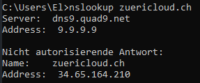  |
| Erfolgreich  | Ok  |

#### MX-Record wird richtig zurückgegeben

| Testszenario | MX-Record wird zurückgegeben, wenn man ein MX-Request stellt  |
|--------------|---|
| Komponenten  | Mailserver   PTR-Record   DNS Dig Tool |
| Erwartet     | 34.65.169.233 -> mx1.zuericloud.ch  |
| Resultat     | mx1.zuericloud.ch   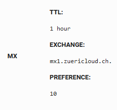 |
| Erfolgreich  | Ok  |

#### PTR-Record für mx.zuericloud.ch ist richtig erfasst

| Testszenario | Bei einer Anfrage auf die IP-Adresse vom Mailserver wird die Domain zurückgegeben   |
|--------------|---|
| Komponenten  | Mailserver   PTR-Record   CMD nslookup  |
| Erwartet     | 34.65.169.233 -> mx1.zuericloud.ch  |
| Resultat     | mx1.zuericloud.ch   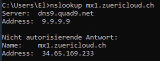 |
| Erfolgreich  | Ok  |

### Nginx

#### location / -> zuericloud.ch Startseite
| Testszenario | Beim Aufruf auf / wird vom Nginx Server der Zuericloud Startseite beantwortet  |
|--------------|---|
| Komponenten  | Nginx Container   Browser   Nginx Reverse Proxy|
| Erwartet     | Die Startseite der Zuericloud AG wird zurückgeben |
| Resultat     | Dem User wird die Startseite dargestellt   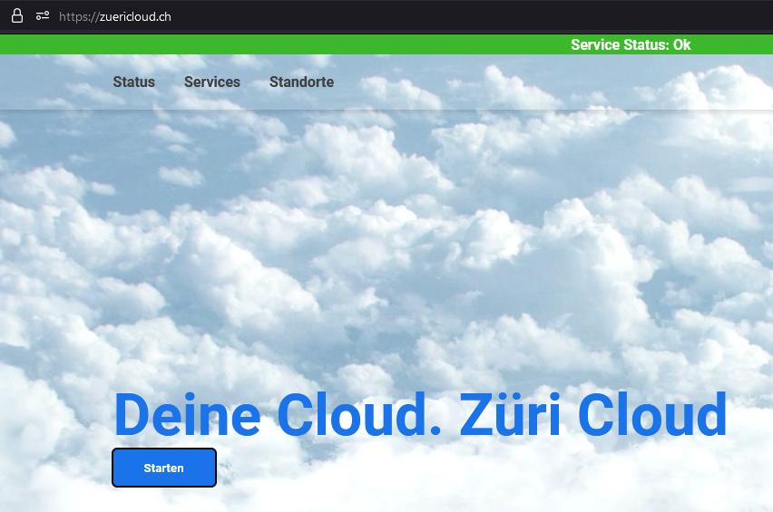 |
| Erfolgreich  | Ok |

#### location /status -> zuericloud.ch/status 

| Testszenario | Beim Aufruf auf /status wird vom Nginx Server der Zuericloud Startseite beantwortet  |
|--------------|---|
| Komponenten  | Nginx Container   Browser   Nginx Reverse Proxy|
| Erwartet     | Die Statusseite wird angezeit |
| Resultat     | Die Statusseite funktioniert und die Werte werden geupdatet  |
| Erfolgreich  | Ok  |

#### location /api -> zuericloud.ch/api Container

| Testszenario | Bei Anfragen auf /api werden diese an die API weitergeleitet  |
|--------------|---|
| Komponenten  | Nginx Container   Browser   Nginx Reverse Proxy|
| Erwartet     | Anfragen kommen zu der API durch |
| Resultat     | HTTP 200 - Anfragen werden beantwortet. Anfrage und Antwort funktioniert  |
| Erfolgreich  | Ok  |

#### location wordpress.zuericloud.ch -> Wordpress Container

| Testszenario | Beim Aufruf der Subdaomin wordpress.zuericloud.ch wird man an die aktuelle Wordpress Seite weitergeleitet   |
|--------------|---|
| Komponenten  | Nginx Reverse Proxy  |
| Erwartet     | Die Anfragen an wordpress.zuericloud.ch werden über den Nginx Reverse Proxy geproxied. Die Anfragen sollen auf den Wordpress Container weitergleitet werden  |
| Resultat     | Die Anfragen werden an wordpress.zuericloud.ch weitergeleitet  |
| Erfolgreich  | Ok  |

#### / wird von HTTP auf HTTPS umgeleitet

| Testszenario | Beim Aufruf der Subdaomin wordpress.zuericloud.ch wird man an die aktuelle Wordpress Seite weitergeleitet   |
|--------------|---|
| Komponenten  | Nginx Reverse Proxy   Website Container   Browser  |
| Erwartet     | Wenn ein User eine Anfrage auf http://zuericloud.ch stellt, wird er auf die HTTPS Seite umgeleitet |
| Resultat     | Die Anfragen auf https umgeleitet  |
| Erfolgreich  | Ok  |

#### Performancetest zuericloud.ch

Über den Performancetest von Google hat sich folgendes Rating ergeben:

https://pagespeed.web.dev/report?url=https%3A%2F%2Fzuericloud.ch%2F&form_factor=desktop

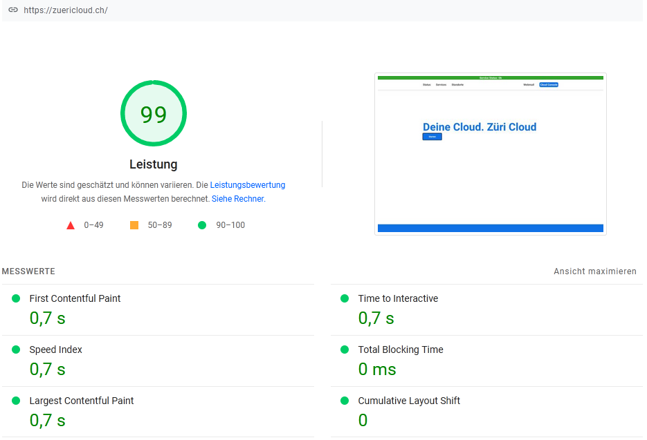

#### Sicherheitstest zuericloud.ch

TLS Test über https://www.ssllabs.com/ssltest/analyze.html?d=zuericloud.ch

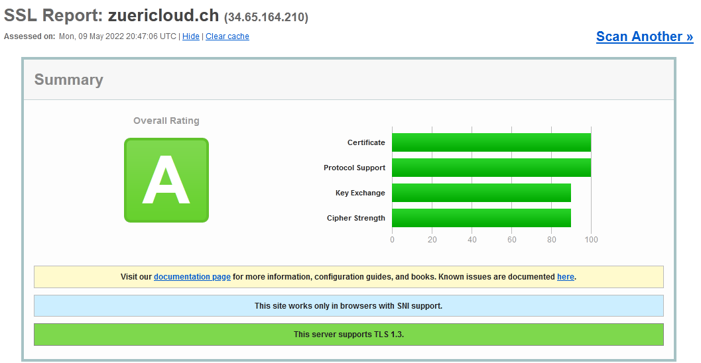

### Wordpress

#### Das Wordpress Login ist über wordpress.zuericloud.ch/wp-login/ erreichbar

Testszenario | Über wordpress.zuericloud.ch/wp-login/ wird das Wordpress Login erreicht  |
|--------------|---|
| Komponenten  | Wordpress Container   Reverse Proxy  |
| Erwartet     | Das Login muss /wp-login erreichbar sein  |
| Resultat     | Login ist erreichbar  |
| Erfolgreich  | Ok  |

#### Der Wordpress Admin kann sich über wp-login anmelden

Testszenario | Der Wordpress Admin kann sich über wordpress.zuericloud.ch/wp-login anmelden |
|--------------|---|
| Komponenten  | Wordpress Container   Reverse Proxy  |
| Erwartet     | Aktiviertes Theme "Twenty Twenty" wird auf wordpress.zuericloud.ch angezeigt  |
| Resultat     | Login funktioniert  |
| Erfolgreich  | Ok  |

#### wordpress.zuericloud.ch ist nur über HTTPS erreichbar, HTTP Redirect funktioniert

Testszenario | Die Wordpress Seite inkl. Login ist nur über HTTPS erreichbar. Über HTTP wird man Redirected  |
|--------------|---|
| Komponenten  | Wordpress Container   Reverse Proxy  |
| Erwartet     | Wenn jemand eine Anfrange auf http://wordpress.zuericloud.ch/ macht, wieder diese auf HTTPS umgeleitet  |
| Resultat     | Anfrage wird auf HTTPS umgeleitet   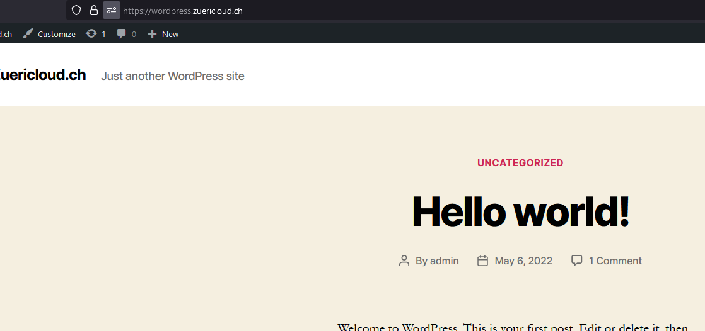  |
| Erfolgreich  | OK  |

#### Admin kann auf wordpress.zuericloud.ch ein neues Template installieren, welches unter wordpress.zuericloud.ch angezeigt wird

Testszenario | Der Admin meldet sich im Wordpress an. Hier lädt er ein neues Template aus und aktiviert es. Dieses wird auf wordpress.zuericloud.ch angezeigt |
|--------------|---|
| Komponenten  | Wordpress Container   Browser |
| Erwartet     | Wenn jemand eine Anfrange auf http://wordpress.zuericloud.ch/ macht, wieder diese auf HTTPS umgeleitet  |
| Resultat     | Anfrage wird auf HTTPS umgeleitet  |
| Erfolgreich  | OK  |

### Nextcloud 

#### Nextcloud ist über zuericloud.ch/nextcloud erreichbar
| Testszenario | Nextcloud ist über zuericloud.ch/nextcloud erreichbar  |
|--------------|---|
| Komponenten  | Nextcloud Server   Nginx Reverse Proxy  |
| Erwartet     | HTTP 200 und Login für Nextcloud  |
| Resultat     | Die Nextcloud Startseite errscheint   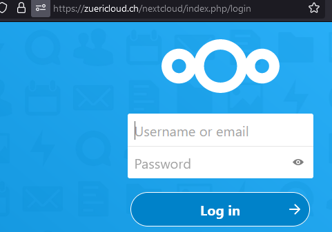 |
| Erfolgreich  | Ok  |

#### Nextcloud Admin kann sich anmelden
| Testszenario | Der Nextcloud Admin kann sich im Nextcloud Login anmelden |
|--------------|---|
| Komponenten  | Nextcloud Server   Nginx Reverse Proxy  |
| Erwartet     | Login funktioniert für den Administrator Benutzer |
| Resultat     | Login funktioniert |
| Erfolgreich  | Ok  |

#### Nextcloud ist nur über HTTPS erreichbar

| Testszenario | Wenn jemand http://zuericloud.ch/nextcloud aufruft, soll er auf https umgeleitet werden |
|--------------|---|
| Komponenten  | Nextcloud Server   Nginx Reverse Proxy  |
| Erwartet     | Umleitung auf HTTPS funktioniert korrekt |
| Resultat     | Umleitung funktioniert |
| Erfolgreich  | Ok  |

### Mailserver

#### Webmail erreichbar

| Testszenario | Das Webmail ist über mail.zuericloud.ch erreichbar |
|--------------|---|
| Komponenten  | Mailserver   Nginx Reverse Proxy   Roundcube |
| Erwartet     | HTTP 200 und Login für Roundcube  |
| Resultat     | Roundcube errscheint   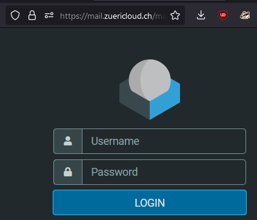 |
| Erfolgreich  | Ok  |

#### Webmail ist nur über HTTPS erreichbar
| Testszenario | Wenn jemand http://mail.zuericloud.ch aufruft, soll er auf https umgeleitet werden |
|--------------|---|
| Komponenten  | Mailserver   Roundcube   Nginx Reverse Proxy  |
| Erwartet     | Umleitung auf HTTPS funktioniert korrekt |
| Resultat     | Umleitung funktioniert |
| Erfolgreich  | Ok  |

#### Login im Webmail funktioniert mit lokalem @zuericloud.ch User

| Testszenario | Ein Mailuser der Domain @zuericloud.ch kann sich im Webmail anmelden. Im Test wird es mit postmaster@zuericloud.ch gemacht |
|--------------|---|
| Komponenten  | Mailserver   Nginx Reverse Proxy   Roundcube|
| Erwartet     | HTTP 200 und Login für Roundcube  |
| Resultat     | Roundcube Inbox für postmaster@zuericloud.ch errscheint   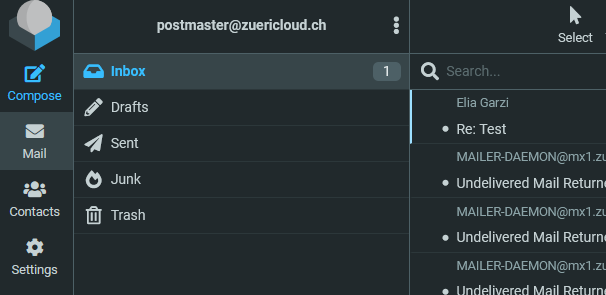 |
| Erfolgreich  | Ok  |

#### Mail von @zuericloud.ch Adresse

| Testszenario | Das senden von einer @zuericloud.ch Adresse an einen externen E-Mail Server funktioniert  |
|--------------|---|
| Komponenten  | Sendgrid Mailrelay   Postfix   Mailserver   Roundcube Webmail   Externer Mailclient  |
| Erwartet     | E-Mail wird empfangen  |
| Resultat     | 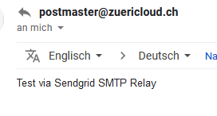  |
| Erfolgreich  | Ok  |

#### Mail an @zuericloud.ch Adresse

| Testszenario |   |
|--------------|---|
| Komponenten  | Dovecot   Mailserver   Roundcube Webmail   Externer Mailclient    |
| Erwartet     | Mail wird im Roundcube empfangen   |
| Resultat     | 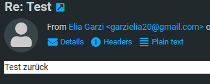  |
| Erfolgreich  | Ok  |

#### SSH darf nicht über öffentliche IP-Adresse funktionieren 

| Testszenario |   |
|--------------|---|
| Komponenten  | SSH Client  |
| Erwartet     | Connection timed out   |
| Resultat     | 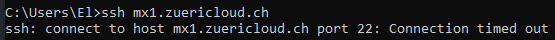  |
| Erfolgreich  | Ok  |

#### SSH funktioniert nur über den Wireguard VPN

| Testszenario |   |
|--------------|---|
| Komponenten  | Wireguard Client   Wireguard Server   SSH-Client  |
| Erwartet     | Anfrage kommt durch die Firewall und wird akzeptiert  |
| Resultat     | 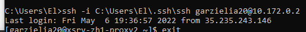 |
| Erfolgreich  | Ok  |

