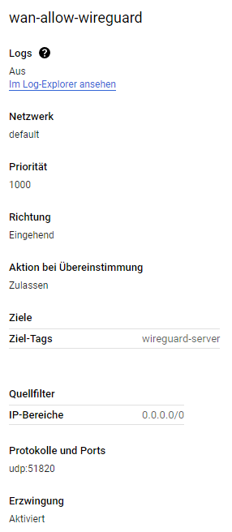

# Anforderungen

## Inhaltsverzeichnis
- [Anforderungen](#anforderungen)
  - [Inhaltsverzeichnis](#inhaltsverzeichnis)
  - [1 Wireguard VPN](#1-wireguard-vpn)
    - [1.1 Wireguard Installation](#11-wireguard-installation)
    - [1.2 Firewall regeln](#12-firewall-regeln)
    - [1.3 SSH Keys](#13-ssh-keys)
    - [1.4 Testing](#14-testing)
    - [1.5 Probleme](#15-probleme)

## 1 Wireguard VPN

Zur sicheren Verbindung mit der Google Cloud installiere ich einen Wireguard VPN-Server. Wireguard nutzte ich ebenfalls privat und es ist ein sehr zuverlässiger und schneller VPN.

### 1.1 Wireguard Installation

Zuerst muss man das EPEL Repository installieren. EPEL = Extra Packages for Enterprise Linux.

      sudo yum install https://dl.fedoraproject.org/pub/epel/epel-release-latest-8.noarch.rpm
      
      sudo yum install https://www.elrepo.org/elrepo-release-8.el8.elrepo.noarch.rpm

Paketliste updaten

      yum update

Installation der Wireguard Pakete

      yum install kmod-wireguard wireguard-tools

Generieren eines neuen Public/Private Key-Pair.

      wg genkey | tee /etc/wireguard/private.key

      chmod go= /etc/wireguard/private.key

      cat /etc/wireguard/private.key | wg pubkey | sudo tee /etc/wireguard/public.key

Auslesen des Private und Public Key. Diese werden später für die Konfiguration benötigt.

      cat /etc/wireguard/private.key

      cat /etc/wireguard/public.key

Konfiguration Wireguard Interface wg0 unter /etc/wireguard/wg0.conf

      [Interface]
      Address = 10.47.2.1/30
      ListenPort = 51820
      PrivateKey = 
      PostUp = iptables -A FORWARD -i %i -j ACCEPT; iptables -t nat -A POSTROUTING -o eth0 -j MASQUERADE
      PostDown = iptables -D FORWARD -i %i -j ACCEPT; iptables -t nat -D POSTROUTING -o eth0 -j MASQUERADE

      [Peer]
      PublicKey = 
      AllowedIPs = 10.47.2.2

Ebenfalls muss man auf dem Wireguard Server noch ipv4 Forwarding enablen.

      vi /etc/sysctl.conf     
      net.ipv4.ip_forward = 1

Auf dem Client generiere ich ebenfalls ein public/private Key Pair. Den hier generierten Public Key muss ich beim Peer 1 auf dem Wireguard Server erfassen.

      [Interface]
      PrivateKey = privatekey
      Address = 10.47.2.2/30
      DNS = 9.9.9.9

      [Peer]
      PublicKey = publickey
      AllowedIPs = 10.172.0.0/24
      Endpoint = zuericloud.ch:51820

Quellen:

<https://www.wireguard.com/install/>

<https://access.redhat.com/documentation/en-us/red_hat_enterprise_linux/6/html/load_balancer_administration/s1-lvs-forwarding-vsa>

<https://access.redhat.com/documentation/en-us/red_hat_enterprise_linux/9-beta/html/configuring_and_managing_networking/assembly_setting-up-a-wireguard-vpn_configuring-and-managing-networking>

### 1.2 Firewall regeln

Damit der Wireguard Server erreichbar ist, müssen einige Firewallregeln angepasst werden.

Auf dem Server:

      firewall-cmd --permanent --add-port=51820/udp --zone=public

      firewall-cmd --permanent --zone=public --add-masquerade

      firewall-cmd --reload

In der GCP Console erstelle ich eine neue Regel. Traffic der von der Quelle 0.0.0.0/0 (alles) auf die Server mit dem Tag "wireguard-server" den Port 51820 verbinden wollen, werden zu gelassen.

Die entsprechenden vordefinierten Regeln für SSH kann ich nun so abändern, dass dies nur noch aus dem gleichen Netz möglich ist.

Damit die Verbindung über das Webinterface der Google Cloud Console weiterhin möglich ist, muss man eine neue Firewall Regel für den IAP (Identity-Aware Proxy) erstellen.

      Configure the following settings:
      Name: allow-ingress-from-iap
      Direction of traffic: Ingress
      Target: All instances in the network
      Source filter: IP ranges
      Source IP ranges: 35.235.240.0/20
      Protocols and ports: Select TCP and enter 22,3389 to allow both RDP and SSH.
      Click Create.

Quelle: <https://cloud.google.com/iap/docs/using-tcp-forwarding>

### 1.3 SSH Keys

Um sich nun an den Instanzen zu authentifizieren, muss man mit SSH Public/Private Key Pairs arbeiten.

Ein Keypair generiert man so:

      ssh-keygen -t rsa -f C:\Users\USERNAME\.ssh\ssh -C VM-Username -b 2048

Anschliessend hinterlegt man den Publickey in der jeweiligen Instanz.

Nachdem der Wireguard Server verbunden ist, kann man sich nun mit den Instanzen wie folgt verbinden:

ssh -i "Pfad zum private Key" VM-Username@10.172.0.6

Quellen:

<https://cloud.google.com/compute/docs/instances/connecting-to-instance?hl=de>

<https://cloud.google.com/compute/docs/connect/add-ssh-keys?hl=de#os-login>

<https://cloud.google.com/compute/docs/instances/connecting-advanced?hl=de>

### 1.4 Testing

Sicherstellen, dass im Protokolllog vom Wireguard Client der Handshake zwischen Client und Server funktioniert.

Sicherstellen, dass man die VMs aus dem Netz erreichen und pingen kann.

### 1.5 Probleme

Bei der Installation kam es zu einigen Problemen. Der Wireguard Server konnte nicht starten, da er kein Interface wg0 erstellen konnte. Der Fehler war "unkown device".

Mit "modprobe wireguard" ergab sich der Fehler "Required key not available". Da ich beim erstellen der VM secure boot aktiviert hatte, war es nun nicht möglich, dass unsignierte Kernelmodule geladen werden können. Die Lösung war es also Secure Boot zu deaktivieren.

Quelle: <https://blog.formf.de/2020/06/wireguard/>